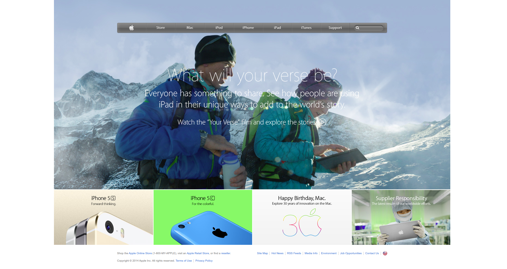

# Project Name

> This is a Apple clone page.

Additional description about the project and its features.

## Built With

- HTML
- CSS

## Live Demo

[Live Demo Link](https://rawcdn.githack.com/MFahadUmer/apple/5c722b52cb4d67928862c65fa050987dec190ed5/index.html)

## Getting Started

**Need web browser.**

To get a local copy up and running follow these simple example steps.

### Open a web browser

### Visit Repository

### Download Repository (git@github.com:MFahadUmer/apple.git)

### Run index.html file

## Authors

👤 **Muhammad Fahad Umer**

- Github: [@MFahadUmer](https://github.com/MFahadUmer)
- Twitter: [@engfahadumer](https://twitter.com/engfahadumer)
- Linkedin: [linkedin](https://www.linkedin.com/in/engineer-muhammad-fahad-e-umer-08813055/)

## 🤝 Contributing

Contributions, issues and feature requests are welcome!

Feel free to check the [issues page](https://github.com/MFahadUmer/apple/issues).

## Show your support

Give a ⭐️ if you like this project!

## Acknowledgments

- Hat tip to anyone whose code was used
- Inspiration
- etc

